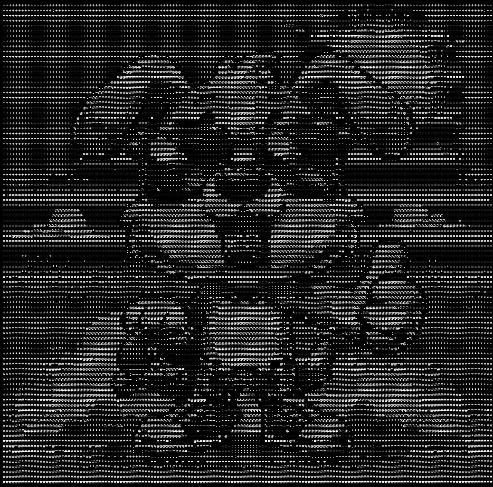
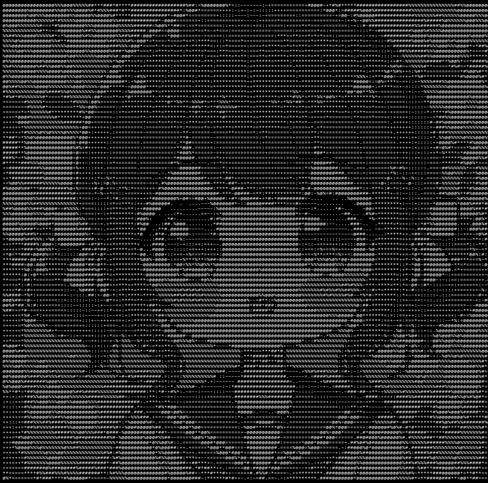

# ASCII Art Generator (Asskey)

Convert images into ASCII art or create ASCII art from scratch with DALL-e 3

## Quick start

```sh
$ python3 -m venv venv
$ source venv/bin/activate
$ pip install -r requirements.txt
$ ./image_to_ascii.py <input_image> <output_file>
$ ./prompt_to_ascii.py <output_file> <prompt>
$ python webapp.py  # start web UI
```

The web interface lets you adjust output width, choose from multiple character sets (Standard, Blocks, Dots, Dense, Binary), or supply a custom character string and download your ASCII art as text or image.

To use `prompt_to_ascii.py` you need to add your OpenAI API key into a `.env` file (see `.env.sample`).
You may also specify `OPENAI_BASE_URL` if using a custom OpenAI-compatible API endpoint and `OPENAI_MODEL` to set the image model.

## Example 1

```sh
$ ./image_to_ascii.py images/dog.webp dog.jpg
```



## Example 2

```sh
$ ./prompt_to_ascii.py girl.jpg "a cute anime girl"
```


